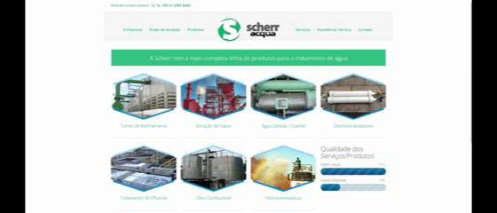

# 🧪 Scherr Química


> Website institucional desenvolvido para a **Scherr Química**, com foco em fortalecer sua presença digital por meio de uma interface moderna, responsiva e intuitiva.

## 🚀 Status do Projeto

Este projeto foi desenvolvido para um cliente real.

✅ Desenvolvimento concluído  
⏳ A implementação/publicação oficial pelo cliente ainda está pendente.

A versão disponível neste repositório representa o trabalho entregue e pode sofrer pequenas diferenças em relação à versão que será publicada pelo cliente.

## 🌐 Demonstração

**🔗 Projeto Online:**  
https://iagodavila.github.io/site-scherr-quimica/

---

## 📸 Preview



---

## 📖 Sobre o Projeto

O **Scherr Química** é um website institucional desenvolvido para apresentar a empresa, seus serviços, diferenciais e canais de contato de forma clara e profissional.

O projeto foi desenvolvido priorizando desempenho, acessibilidade, organização do código e uma experiência consistente em diferentes dispositivos, garantindo uma navegação simples e eficiente para os visitantes.

---

## ✨ Funcionalidades

- ✅ Página inicial institucional
- ✅ Apresentação da empresa
- ✅ Seção de serviços
- ✅ Seção Sobre
- ✅ Informações de contato
- ✅ Botões de chamada para ação (CTA)
- ✅ Navegação fluida entre as seções
- ✅ Interface moderna
- ✅ Layout totalmente responsivo

---

## 🛠️ Tecnologias Utilizadas

- HTML5
- CSS3
- JavaScript (ES6+)
- Git
- GitHub
- GitHub Pages

---

## 📱 Responsividade

Desenvolvido seguindo os princípios de **Responsive Web Design**, proporcionando uma experiência consistente em diferentes dispositivos.

- 📱 Smartphones
- 📲 Tablets
- 💻 Notebooks
- 🖥️ Desktop

---

## 📂 Estrutura do Projeto

```text
📦 site-scherr-quimica
├── assets
│   ├── css
│   ├── images
│   ├── js
│   └── icons
├── index.html
└── README.md
```

---

## 🚀 Como Executar

Clone o repositório:

```bash
git clone https://github.com/IagodAvila/site-scherr-quimica.git
```

Entre na pasta:

```bash
cd site-scherr-quimica
```

Abra o arquivo **index.html** em seu navegador ou utilize a extensão **Live Server** do Visual Studio Code.

---

## 🎯 Destaques do Desenvolvimento

Durante o desenvolvimento foram aplicadas boas práticas como:

- HTML5 semântico
- CSS moderno (Flexbox e Grid)
- JavaScript para interatividade
- Design Responsivo (Mobile First)
- Organização de arquivos
- Código limpo e de fácil manutenção
- Boas práticas de UI/UX
- Versionamento com Git
- Deploy utilizando GitHub Pages

---

## 👨‍💻 Desenvolvedor

**Iago D'Ávila**

📧 iago.davila.dev@gmail.com

**GitHub**  
https://github.com/IagodAvila

**LinkedIn**  
https://www.linkedin.com/in/iago-davila-dev/

---

## 📄 Licença

Este repositório foi disponibilizado para demonstrar o desenvolvimento do projeto. A identidade visual, a marca e os conteúdos apresentados pertencem à **Scherr Química**.
