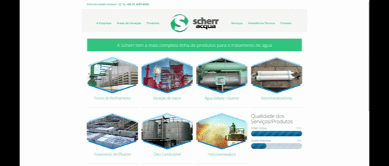

# 🧪 Scherr Química


> Website institucional desenvolvido para a **Scherr Química**, com foco em fortalecer sua presença digital por meio de uma interface moderna, responsiva e intuitiva.

## 🚀 Status do Projeto

Este projeto foi desenvolvido para um cliente real.

✅ Desenvolvimento concluído  
⏳ A implementação/publicação oficial pelo cliente ainda está pendente.

A versão disponível neste repositório representa o trabalho entregue e pode sofrer pequenas diferenças em relação à versão que será publicada pelo cliente.

## 🌐 Demonstração

**🔗 Projeto Online:**  
https://iagodavila.github.io/site-scherr-quimica/

---

## 📸 Preview



---

## 📖 Sobre o Projeto

O **Scherr Química** é um website institucional desenvolvido para apresentar a empresa, seus serviços, diferenciais e canais de contato de forma clara e profissional.

O projeto foi desenvolvido priorizando desempenho, acessibilidade, organização do código e uma experiência consistente em diferentes dispositivos, garantindo uma navegação simples e eficiente para os visitantes.

---

## ✨ Funcionalidades

- ✅ Página inicial institucional
- ✅ Apresentação da empresa
- ✅ Seção de serviços
- ✅ Seção Sobre
- ✅ Informações de contato
- ✅ Botões de chamada para ação (CTA)
- ✅ Navegação fluida entre as seções
- ✅ Interface moderna
- ✅ Layout totalmente responsivo

---

## 🛠️ Tecnologias Utilizadas

- HTML5
- CSS3 + Tailwind CSS (build estático via CLI, sem CDN)
- JavaScript (ES6+)
- Git
- GitHub
- GitHub Pages

---

## 📱 Responsividade

Desenvolvido seguindo os princípios de **Responsive Web Design**, proporcionando uma experiência consistente em diferentes dispositivos.

- 📱 Smartphones
- 📲 Tablets
- 💻 Notebooks
- 🖥️ Desktop

---

## 📂 Estrutura do Projeto

```text
📦 site-scherr-quimica
├── assets/              # imagens, favicons e o CSS gerado pelo Tailwind (app.css)
├── docs/                # material de apoio ao repositório (gif de demonstração)
├── src/input.css        # entrada do build do Tailwind
├── index.html
├── privacidade.html      # rascunho de política de privacidade (LGPD)
├── 404.html              # página de erro customizada (GitHub Pages)
├── script.js
├── style.css             # overrides manuais além do Tailwind
├── tailwind.config.js
└── README.md
```

---

## 🚀 Como Executar

Clone o repositório:

```bash
git clone https://github.com/IagodAvila/site-scherr-quimica.git
```

Entre na pasta:

```bash
cd site-scherr-quimica
```

Instale as dependências e suba o ambiente local:

```bash
npm install      # só na primeira vez
npm run dev      # http://localhost:8080
```

O `npm run dev` sobe um servidor estático **e** deixa o Tailwind recompilando a cada alteração.
Ctrl+C encerra os dois.

> **Não abra o `index.html` por `file://`.** As páginas de serviço usam caminhos absolutos
> (`/assets/app.css`, `/tratamento-de-agua-de-caldeiras/`), que só resolvem sob um servidor.
> O **Live Server** do VS Code também funciona, desde que a pasta aberta seja a raiz do projeto.

### Scripts

| Script | O que faz |
| --- | --- |
| `npm run dev` | Servidor em `localhost:8080` + Tailwind em watch |
| `npm run serve` | Só o servidor estático |
| `npm run watch:css` | Só o Tailwind em watch |
| `npm run build:css` | Compila `assets/app.css` **minificado** |
| `npm run build` | Regera as páginas de serviço e compila o CSS minificado |

> ⚠️ O `npm run dev` grava o `assets/app.css` **sem minificar**. Rode `npm run build:css`
> antes de commitar, senão vai um CSS inflado para o repositório.

### Alterando estilos (Tailwind)

O CSS não é gerado via CDN em tempo de execução — ele é compilado para `assets/app.css` e commitado no
repositório, para o site continuar 100% estático no GitHub Pages. O Tailwind varre `./*.html` e `./*/*.html`
(veja `tailwind.config.js`); uma classe usada em um arquivo fora desses padrões **não entra no CSS**.

### Páginas de serviço

As 6 páginas em `/tratamento-de-agua-de-caldeiras/`, `/tratamento-de-efluentes-industriais/` etc. são
**geradas**, não editadas à mão — elas compartilham header, rodapé, CTA e JSON-LD. O texto de cada uma fica
em `tools/paginas_conteudo.py`. Veja [`tools/README.md`](tools/README.md).

### Formulário de contato

O envio continua via `mailto:`: ao submeter, o navegador abre o cliente de e-mail do visitante com os dados já
preenchidos, direcionado para `scherr@scherr.com.br`. Isso não depende de nenhum serviço externo, mas só
funciona se o dispositivo do visitante tiver um cliente de e-mail configurado. Se no futuro alguém com acesso
ao e-mail `scherr@scherr.com.br` quiser um envio mais confiável (sem depender do cliente de e-mail do
visitante), dá pra integrar um serviço gratuito como o [Web3Forms](https://web3forms.com), que só exige gerar
uma *Access Key* pelo próprio e-mail da empresa.

### Imagens

**Créditos e licença das fotos de banco**

| Arquivo | Origem | Licença |
| --- | --- | --- |
| `assets/hero-estacao-tratamento.jpg` | [Pexels, foto 35425762](https://www.pexels.com/photo/35425762/) | Licença Pexels — uso comercial livre, sem atribuição obrigatória |

As demais imagens em `assets/` vieram do projeto original; a origem não está registrada.
Vale confirmar a licença de cada uma antes de qualquer uso fora do site.


O hero e os banners das seções de Serviços, Sobre e Parceiros usam fotos de banco gratuito
([Pexels](https://www.pexels.com), licença livre para uso comercial, sem exigência de atribuição) como
**placeholder genérico** — nenhuma delas retrata a fábrica, o laboratório ou a equipe reais da Scherr Química.
Assim que houver fotos reais da empresa disponíveis, elas devem substituir esses arquivos em `assets/`:

| Arquivo | Onde é usada |
|---|---|
| `assets/hero-water-treatment.jpg` | Hero (topo da página) |
| `assets/about-industrial-valves.jpg` | Fundo do card "Nossa missão" (Sobre) |
| `assets/services-lab-testing.jpg` | Banner da seção Serviços |
| `assets/partners-water-drop.jpg` | Banner da seção Parceiros |

---

## 🎯 Destaques do Desenvolvimento

Durante o desenvolvimento foram aplicadas boas práticas como:

- HTML5 semântico
- CSS moderno (Flexbox e Grid)
- JavaScript para interatividade
- Design Responsivo (Mobile First)
- Organização de arquivos
- Código limpo e de fácil manutenção
- Boas práticas de UI/UX
- Versionamento com Git
- Deploy utilizando GitHub Pages

---

## 👨‍💻 Desenvolvedor

**Iago D'Ávila**

📧 iago.davila.dev@gmail.com

**GitHub**  
https://github.com/IagodAvila

**LinkedIn**  
https://www.linkedin.com/in/iago-davila-dev/

---

## 📄 Licença

Este repositório foi disponibilizado para demonstrar o desenvolvimento do projeto. A identidade visual, a marca e os conteúdos apresentados pertencem à **Scherr Química**.
